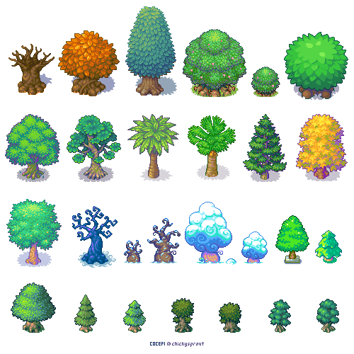

# Money Trees 🌱💰

> _"A dollar might turn to a million and we all rich"_

**Keep track of your finances and watch them grow** — A modern financial tracking application that embraces the garden metaphor for financial growth, built with data ownership and portability at its core.



## Philosophy: File Over App

Money Trees is built around the **"File Over App"** philosophy, as championed by Steph Ango, CEO of Obsidian:

> _"File over app is a philosophy: if you want to create digital artifacts that last, they must be files you can control, in formats that are easy to retrieve and read. Use tools that give you this freedom."_

### Why This Matters for Your Financial Data

- **📁 Your Data, Your Control**: All financial data can be exported as standard CSV files
- **🔄 No Lock-in**: Switch to any other financial tool without losing your history
- **🕰️ Future-Proof**: CSV format has existed for decades and will outlast any app
- **🔒 Privacy First**: Your financial data stays on your device and in formats you control
- **🌍 Universally Readable**: Open your data in Excel, Google Sheets, or any text editor

> _"In the fullness of time, the files you create are more important than the tools you use to create them. Apps are ephemeral, but your files have a chance to last."_ — Steph Ango

## Features

### 🌱 Garden Visualization

- Interactive canvas showing your financial growth as a flourishing garden
- Visual metaphors that make tracking finances engaging and intuitive
- Real-time collaboration features for shared financial planning

### 📊 Data Management

- **Import**: Seamlessly import existing financial data via CSV
- **Export**: Download your complete financial history anytime
- **Multi-Currency**: Support for USD, EUR, GBP, JPY, NGN, and more

## Tech Stack

Money Trees leverages modern, reliable technologies while maintaining data portability:

- **Frontend**: Next.js, TypeScript
- **Styling**: Tailwind CSS with custom animations
- **State Management**: Jotai for reactive state and local storage management
- **UI Components**: Shadcn/ui for components and charts
- **Visualization**: Custom canvas implementation 

## Getting Started

### Installation

1. **Clone the repository**

   ```bash
   git clone <repository-url>
   cd fusion-hack
   ```

2. **Install dependencies**

   ```bash
   npm install
   ```

4. **Run the development server**

   ```bash
   npm run dev
   ```

5. **Open your browser**
   Navigate to `http://localhost:3000`

### Initial Setup

1. **Configure Your Profile** (`/garden/settings`)

   - Enter your name
   - Select your preferred currency
   - Choose your currency symbol

2. **Import Your Data** (`/garden/import`)

   - Upload existing financial data via CSV
   - Required columns: `date`, `description`, `amount`, `category`

3. **Start Growing Your Garden** (`/garden`)
   - Watch your financial data come to life in the garden visualization
   - Add new transactions and see your money tree grow

## File Formats & Data Portability

### CSV Structure

Your financial data uses a simple, universal format:

```csv
date,description,amount,category,id
2024-01-15,"Coffee Shop",4.50,"Food",uuid-1234
2024-01-15,"Salary",3000.00,"Income",uuid-5678
2024-01-16,"Rent",1200.00,"Housing",uuid-9012
```
## Acknowledgments

- **Steph Ango** for the File Over App philosophy
- **The Obsidian Team** for demonstrating how to build tools that respect user data ownership
- **The Open Source Community** for creating the technologies that make data portability possible

---

_Made with 💜 by Shehu_

